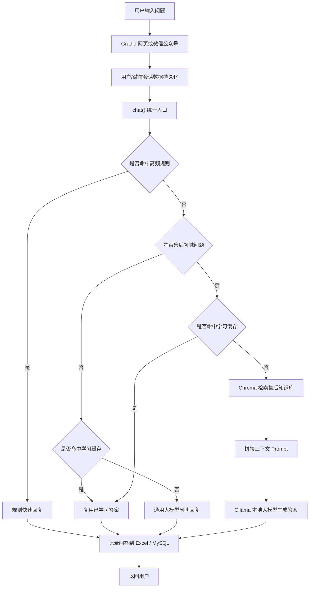

# 星选商城电商售后智能客服系统

这是一个面向电商售后场景的智能客服演示项目。项目将原始咖啡店问答机器人改造成 **星选商城售后客服“小小易”**，支持网页聊天和微信公众号测试号接入，能够处理订单查询、物流查询、取消订单、退款、退货退款、换货、补发、催发货、修改地址、拒收、价保、发票咨询、投诉升级和人工客服登记等常见售后问题。

项目适合放在简历中作为“智能客服 / RAG 应用 / 大模型应用开发”方向的项目经历。

## 项目亮点

- 使用 **Python + Gradio** 搭建中文客服聊天页面，方便本地演示。
- 使用 **规则快速回复 + RAG 知识库检索 + 本地大模型生成** 的混合方案，兼顾响应速度和回答覆盖面。
- 使用 **Chroma 向量数据库** 保存售后知识库，支持基于语义相似度检索相关资料。
- 使用 **Ollama + qwen3:4b** 在本地运行大模型，减少对外部 API 的依赖。
- 支持 **DeepSeek API**，配置 `DEEPSEEK_API_KEY` 后优先调用 DeepSeek，失败时自动回退本地 Ollama。
- 支持 **微信公众号测试号** 接入，用户可以在微信中向“小小易”发送售后问题。
- 支持 **订单数据库、用户登录、订单列表、工单系统和后台管理页面**。
- 支持 **图片凭证上传**，用于破损、错发、少件、质量问题等售后凭证记录。
- 支持 **微信会话历史持久化**，服务重启后仍能从数据库读取最近上下文。
- 支持 **问答学习记录**：自动把用户问题和客服回答保存为 Excel，并在配置 MySQL 后同步写入数据库。
- 支持 **本地学习缓存**：大模型兜底回答会被记录为可复用问答，后续相同问题可优先从缓存回复，减少重复调用大模型。
- 针对正式售后客服流程设计回复结构：确认诉求、核验订单、判断状态、给出方案、说明时效、引导下一步。
- 增加多轮上下文处理，避免用户说“好的”时重复上一条订单结果。
- 增加自动化冒烟测试，覆盖常见售后问题、闲聊、上下文承接和兜底回复。

## 功能范围

当前系统支持以下售后场景：

- 订单状态查询
- 物流进度查询
- 取消订单
- 仅退款
- 退货退款
- 换货
- 补发
- 催发货
- 修改地址
- 拒收处理
- 价保咨询
- 商品破损、漏液、质量问题
- 少件、漏发、错发
- 发票咨询
- 投诉升级
- 人工客服登记
- 用户登录和订单列表
- 售后凭证图片上传
- 客服后台查看工单、会话和凭证
- 简单日常交流

示例问题：

```text
你是谁？
你能做什么？
正式售后客服标准流程是什么？
订单 EC20260702002 物流到哪了？
订单 EC20260702003 怎么还不发货？
订单 EC20260702002 我想改地址
我想退货退款，需要怎么操作？
商品破损了怎么办？
我想申请价保
我要投诉，处理太慢了
```

## 技术栈

| 模块 | 技术 |
| --- | --- |
| 开发语言 | Python |
| Web 界面 | Gradio |
| 后端接口 | FastAPI、Uvicorn |
| 微信接入 | 微信公众号测试号、XML 消息回调 |
| 应用数据库 | SQLite 默认、本地 MySQL 可选 |
| 知识库检索 | RAG |
| 向量数据库 | Chroma |
| Embedding 模型 | nomic-embed-text |
| 大模型 | DeepSeek API、Ollama、qwen3:4b |
| 问答记录 | openpyxl、Excel |
| 数据库存储 | MySQL、PyMySQL |
| 测试 | smoke_test.py 冒烟测试 |

## 系统架构



## 数据库与业务模块

项目新增 `app_database.py`，用于统一管理业务数据。

默认情况下，系统会使用本地 SQLite 数据库：

```text
data/xiaoxiaoyi_app.db
```

当前数据库保存：

- 用户信息
- 订单信息
- 工单记录
- 网页/微信会话记录
- 售后凭证文件记录

如果要切换到 MySQL，可以设置：

```shell
$env:APP_DB_BACKEND="mysql"
$env:MYSQL_HOST="127.0.0.1"
$env:MYSQL_PORT="3306"
$env:MYSQL_USER="root"
$env:MYSQL_PASSWORD="你的MySQL密码"
$env:MYSQL_DATABASE="xiaoxiaoyi_chatbot"
```

然后启动：

```shell
.conda\python.exe main.py
```

系统会自动创建所需数据表。

## DeepSeek 配置

项目默认本地 Ollama 可用。若要优先使用 DeepSeek，在启动前设置：

```shell
$env:DEEPSEEK_API_KEY="你的DeepSeek Key"
$env:LLM_PROVIDER="auto"
```

说明：

- `LLM_PROVIDER=auto`：有 DeepSeek Key 时优先 DeepSeek，失败后回退 Ollama。
- `LLM_PROVIDER=ollama`：只使用本地 Ollama。
- `LLM_PROVIDER=deepseek_strict`：只使用 DeepSeek，失败就报错。

可选模型名：

```shell
$env:DEEPSEEK_MODEL="deepseek-chat"
```

## 核心流程说明

### 1. 高频规则快速回复

在 `main.py` 中，`quick_answer()` 会优先处理高频售后问题，例如订单查询、退款、换货、物流异常、发票、投诉、转人工等。

这样设计的原因：

- 售后高频问题答案相对固定，用规则回复更快。
- 可以避免每个问题都调用大模型，降低延迟。
- 对订单号、确认语、流程问题做了特殊处理，减少上下文误判。

### 2. RAG 知识库问答

对于没有命中规则、但仍属于售后领域的问题，系统会进入 RAG 流程：

1. 用户问题进入 `chat()`。
2. 判断为售后领域问题。
3. 使用 Chroma 从 `docs/` 知识库中检索相关内容。
4. 将检索结果和用户问题拼成 Prompt。
5. 调用 Ollama 本地模型生成中文客服回复。

知识库文件位于：

```text
docs/
├── after_sales_policy.txt
├── after_sales_process.txt
├── faq.txt
└── orders_and_logistics.txt
```

### 3. 多轮上下文处理

系统会根据用户输入判断是否需要继承上一轮订单号。

例如：

```text
用户：订单 EC20260702002 物流到哪了？
客服：已为你查询到订单...
用户：它现在还能改地址吗？
客服：会继承上一个订单号，并结合“改地址”场景回答。
```

同时系统会避免错误承接：

```text
用户：订单 EC20260702002 物流到哪了？
客服：已为你查询到订单...
用户：好的
客服：好的，有其他订单或售后问题可以继续发给小小易。
```

### 4. 微信公众号接入

项目新增 `wechat_server.py`，用于接收微信公众号测试号的消息回调。

整体流程：

```text
用户微信发消息
    ↓
微信公众号服务器配置 URL
    ↓
FastAPI 接口 /wechat
    ↓
调用 main.py 中的 chat()
    ↓
返回 XML 格式消息
    ↓
用户在微信中收到回复
```

### 5. 自动学习记录

项目新增 `learning_store.py`，用于记录和复用问答。

工作方式：

1. 用户每次提问后，系统都会把“问题、回答、来源、状态、时间”保存到 `data/qa_learning_records.xlsx`。
2. 如果开启 MySQL 配置，系统会同步写入 `qa_learning_records` 表。
3. 如果某个问题没有命中规则，而是调用了大模型或 RAG 生成答案，系统会把该问答加入 `data/learned_qa.jsonl`。
4. 用户后续再次问到完全相同的问题时，系统会优先复用本地已学习答案，减少重复调用大模型。
5. 如果设置 `LEARNING_DELETE_AFTER_LEARNED=1`，模型兜底答案被学习后，会从 Excel/MySQL 的临时记录中清理，只保留轻量学习缓存。

> 注意：正式生产环境不建议让系统无审核地学习所有大模型答案，因为大模型可能答错。更稳的做法是把新问答标记为待审核，经人工确认后再进入正式知识库。

## 项目目录

```text
customer-chatbot-demo-agent-rag-langchain
├── docs/                          # 电商售后知识库资料
├── chroma/                        # Chroma 本地向量数据库
├── main.py                        # Gradio 网页和客服主逻辑
├── app_database.py                # 用户、订单、工单、会话和凭证数据层
├── learning_store.py              # 问答记录、Excel/MySQL 写入和学习缓存
├── model_provider.py              # DeepSeek / Ollama 大模型调用封装
├── prepare_chroma.py              # 重新生成知识库索引
├── smoke_test.py                  # 功能冒烟测试
├── wechat_server.py               # 微信公众号回调服务
├── WECHAT_SETUP.md                # 微信测试号接入说明
├── PROJECT_KNOWLEDGE_FOR_INTERVIEW.md  # 面试知识点整理
└── README.md                      # 项目说明
```

## 本地运行

项目位置：

```text
D:\customer-chatbot-demo-agent-rag-langchain
```

启动网页客服：

```shell
cd /d D:\customer-chatbot-demo-agent-rag-langchain
.conda\python.exe main.py
```

浏览器访问：

```text
http://127.0.0.1:7860
```

默认测试账号：

```text
手机号：13800000001
密码：123456
```

另一个测试账号：

```text
手机号：13800000002
密码：123456
```

## 重新生成知识库

修改 `docs/` 下的售后资料后，需要重新生成 Chroma 知识库：

```shell
cd /d D:\customer-chatbot-demo-agent-rag-langchain
.conda\python.exe prepare_chroma.py
```

## 运行测试

```shell
cd /d D:\customer-chatbot-demo-agent-rag-langchain
.conda\python.exe smoke_test.py
```

## MySQL 学习记录配置

Excel 记录默认自动开启，文件会生成在：

```text
data\qa_learning_records.xlsx
```

如果要同步写入 MySQL，需要先启动 MySQL，并设置环境变量：

```shell
$env:LEARNING_MYSQL_ENABLED="1"
$env:MYSQL_HOST="127.0.0.1"
$env:MYSQL_PORT="3306"
$env:MYSQL_USER="root"
$env:MYSQL_PASSWORD="你的MySQL密码"
$env:MYSQL_DATABASE="xiaoxiaoyi_chatbot"
```

然后启动项目：

```shell
.conda\python.exe main.py
```

系统会自动创建数据库和表：

```text
qa_learning_records
```

如果希望“大模型答案学会后清理临时记录”，可以额外设置：

```shell
$env:LEARNING_DELETE_AFTER_LEARNED="1"
```

测试覆盖：

- 问候、身份介绍、简单闲聊
- 订单查询
- 催发货、修改地址、拒收、价保
- 取消订单、退款、退货退款、换货
- 破损、少件、漏发、物流异常
- 发票、质保、投诉、转人工
- 多轮上下文承接
- 确认语不重复订单结果
- 高风险问题兜底提醒
- 数据库订单查询、工单登记和会话保存

## 简历写法

项目名称：

```text
基于 RAG 的电商售后智能客服系统
```

项目描述：

```text
基于 Python、Gradio、FastAPI、SQLite/MySQL、Chroma、Ollama、DeepSeek API 和 RAG 实现电商售后智能客服系统，模拟电商平台售后客服“小小易”。系统支持用户登录、订单列表、订单查询、物流查询、取消订单、退款、退货退款、换货、补发、催发货、修改地址、拒收、价保、发票咨询、投诉升级、人工客服登记、图片凭证上传和后台工单管理。项目采用规则快速回复处理高频问题，结合 Chroma 向量数据库和大模型完成知识库问答，并通过 FastAPI 接入微信公众号测试号，实现网页端和微信端双入口客服体验。
```

职责描述：

```text
1. 负责将原始客服 Demo 改造成电商售后客服场景，设计订单、物流、退款、换货、补发等售后流程。
2. 设计规则快速回复模块，提升高频售后问题响应速度，并优化多轮上下文承接。
3. 构建本地售后知识库，使用 Chroma 和 Embedding 模型实现语义检索。
4. 接入 Ollama 本地大模型，对复杂售后问题进行 RAG 问答生成。
5. 接入 DeepSeek API 作为优先大模型服务，并保留 Ollama 本地模型回退方案。
6. 使用 Gradio 搭建中文客服演示页面、用户登录、订单列表和后台管理页面，并使用 FastAPI 对接微信公众号测试号。
7. 设计工单、会话和图片凭证数据表，支持投诉、人工客服、物流核查、退款进度和凭证审核记录。
8. 编写冒烟测试覆盖核心售后场景，验证系统回复完整性和稳定性。
```

## 可继续扩展

- 接入真实订单数据库，例如 MySQL、PostgreSQL 或 MongoDB。
- 增加工单系统，记录投诉、人工客服、物流核查和退款进度。
- 增加后台管理页面，支持客服查看用户会话和处理记录。
- 增加用户登录和订单列表。
- 支持图片上传，用于破损、错发、少件等售后凭证审核。
- 接入真实大模型 API，例如 OpenAI、通义千问、智谱、DeepSeek 等。
- 使用 Redis 或数据库保存微信用户聊天记录，避免服务重启后上下文丢失。
- 增加人工审核后台，把大模型生成的新问答审核后再写入正式知识库。
